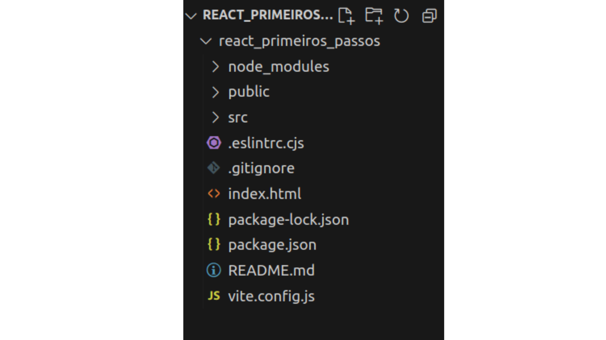
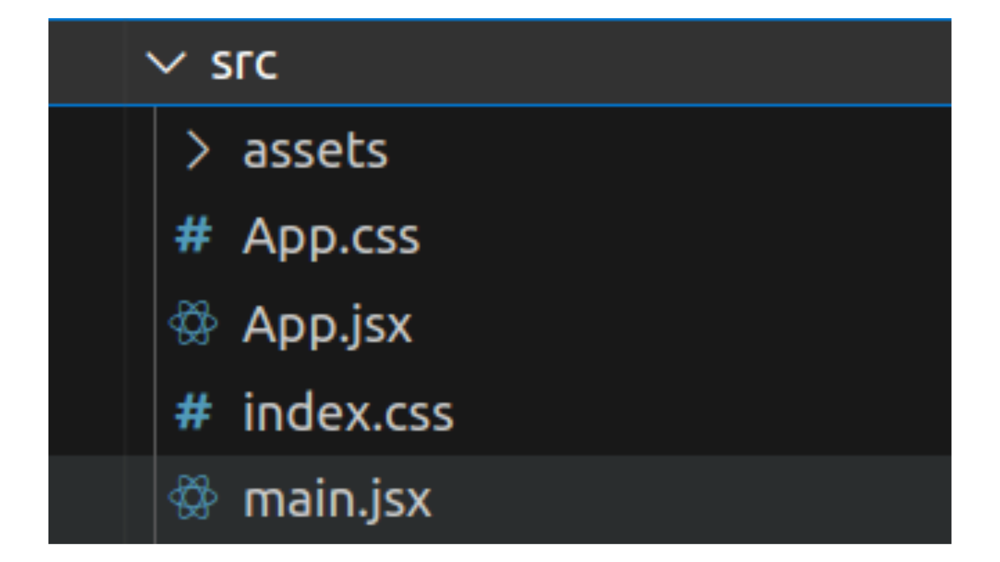
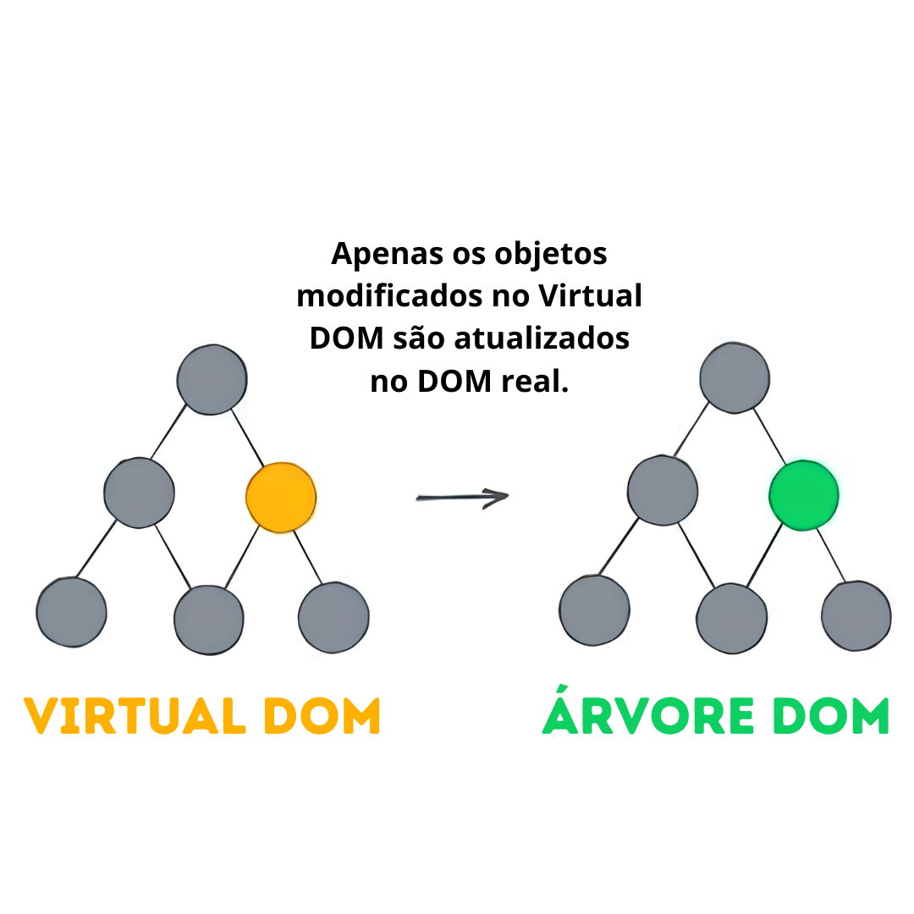

# Guia de Estrutura de Pastas e Arquivos no React 📁🗂️


Ao criarmos um projeto React, somos imediatamente apresentados a diversas pastas e arquivos, cada um com seu propósito específico dentro do ecossistema do React. Essa estrutura, embora inicialmente pode parecer complexa, é essencial para gerenciar os diversos aspectos de uma aplicação React, desde a lógica de negócios até a interface do usuário.

Esta parte é dedicada a desvendar a estrutura de pastas e arquivos que acompanham um projeto React padrão.

 

- **node_modules** --> Pasta criada pelo comando `npm install`, responsável por armazenar todos os pacotes e dependências do projeto. Não é rastreada no controle de versão devido ao seu grande tamanho **(não é enviada para o GitHub)**, **(Também não mexemos nessa pasta)**.

- **public** --> No Vite, esta pasta guarda a logo do Vite e arquivos estáticos (que não mudam com a interação do usuário), como imagens e arquivos CSS.



- **src** --> Esta pasta contém todos os arquivos dos componentes da sua aplicação, que são renderizados na tela e podem mudar dinamicamente com a interação do usuário.

- **app.jsx** --> Esse arquivo contém o componente principal da sua aplicação, também contém todo o conteúdo que e exibido na sua página ao utilizarmos o comando `npm run dev`.

- **main.jsx** --> Nesse arquivo e feita a criação do React, nele importamos e renderizamos o componente `App.jsx` dentro do `index.html`. O conteúdo é renderizado utilizando o DOM com a função `ReactDOM.createRoot().render()` **(Não mexemos nesse arquivo)**.

- **app.css** e **index.css** --> Esses respectivos arquivos contém toda a estilização de sua página.


- **eslintrc.cjs** --> Arquivo que tem como função verificar se o código escrito segue as boas práticas.

- **.gitignore** --> Esse arquivo lista todas as informações que o Git deve ignorar na hora de subir para o Github **(Não mexemos nesse arquivo)**.

- **index.html** --> Esse arquivo guarda o código HTML onde o React monta os componentes **(Não mexemos nesse arquivo)**.

- **package.json** e **package-lock.json** --> Arquivos de configuração de ferramentas e armazenamento de nomes e versões de pacotes instalados **(Não mexemos nesses arquivos)**.

- **README.md** --> Contém informações importantes sobre o projeto.

- **vite.config.js** --> Arquivo de configuração do Vite, permite personalizar configurações para o projeto **(Não mexemos nesse arquivo)**.


## Como o React Monta a Nossa Página 🌐



O React utiliza o DOM Virtual, que é uma cópia do DOM da nossa página, ele guarda o Virtual DOM na memória e apenas as mudanças ocorridas no Virtual DOM são passadas para a atual Árvore DOM. Isso otimiza o desempenho, permitindo que o React faça atualizações na página de forma eficiente.

## Estrutura de um Componente de Função 🖥️


```javascript
export default function App(){
    return(
        <div>
            {/* Seu código aqui */}
        </div>
    )
}
```

- `export default` define o componente que será exportado(enviado) para ser exibido na tela de sua página.

- Cada `function` no React representa um componente. `App()` é o componente principal do React.

- No componente `App` pode ser escrito código HTML e integrado outras partes de seu código.
  
- `return` retorna o código JSX do componente, dentro do return ficará todo seu código HTML de seu componente.

---

Agora você está mais preparado para navegar pela estrutura de pastas e arquivos de seus projetos React, o que é um passo fundamental para se tornar um desenvolvedor(a) eficiente e capaz neste ecossistema.

Lembre-se, a prática leva à perfeição. Portanto, mergulhe nos códigos, experimente, e não tenha medo de explorar e personalizar a estrutura conforme as necessidades do seu projeto!!!

Bons códigos e vamos para os exercícios! 📚👨‍💻

[Exercícios - Clique aqui para praticar!](./2.EstruturaReactExercicios.md)

